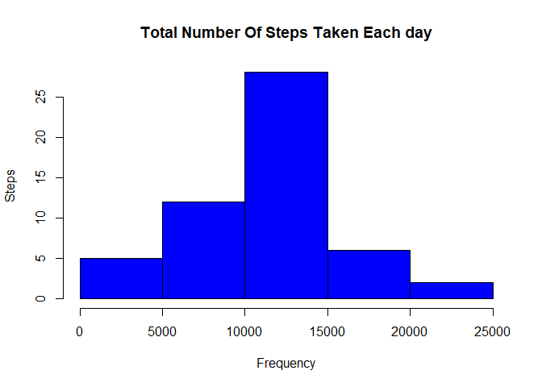
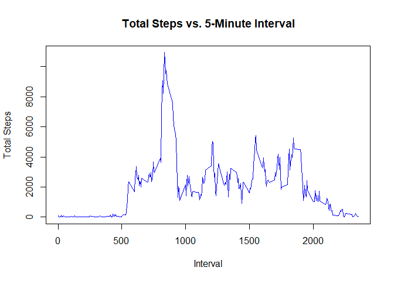
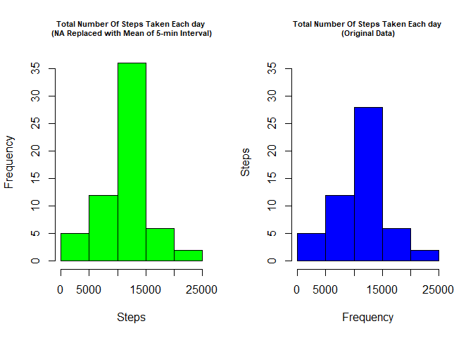
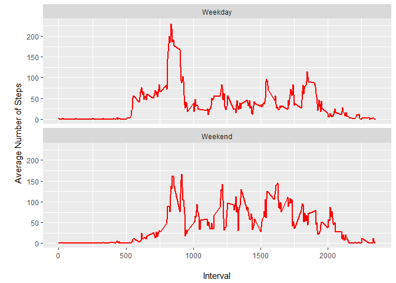

### Load chron, ggplot2 and knitr libraries and set global options for document.

```r
library(chron)
```

```
## Warning: package 'chron' was built under R version 3.4.4
```

```r
library(ggplot2)
library(knitr)
```

```
## Warning: package 'knitr' was built under R version 3.4.4
```

```r
opts_chunk$set(echo = TRUE, results = 'hold')
```


## Loading and preprocessing the data
### 1. Load the data (i.e. read.csv())

```r
## Extract zip file of data if it doesn't exist
if(!file.exists('activity.csv')){
    unzip('activity.zip')
}
## load data into session
activity_Data <- read.csv('activity.csv')

##
```

### 2. Process/transform the data (if necessary) into a format suitable for your analysis

```r
## see sample of data loaded
head(activity_Data)

## Remove 
```

```
##   steps       date interval
## 1    NA 2012-10-01        0
## 2    NA 2012-10-01        5
## 3    NA 2012-10-01       10
## 4    NA 2012-10-01       15
## 5    NA 2012-10-01       20
## 6    NA 2012-10-01       25
```


## What is mean total number of steps taken per day?
### 1. Calculate the total number of steps taken per day

```r
## Summation of steps by date
steps_by_day <- aggregate(steps ~ date, activity_Data, FUN=sum)

## Sample of result data
head(steps_by_day)
```

```
##         date steps
## 1 2012-10-02   126
## 2 2012-10-03 11352
## 3 2012-10-04 12116
## 4 2012-10-05 13294
## 5 2012-10-06 15420
## 6 2012-10-07 11015
```

### 2. Make a histogram of the total number of steps taken each day

```r
## Histogram plot from Base Plotting
hist(steps_by_day$steps, 
     xlab = "Frequency", 
     ylab = "Steps",
     main = "Total Number Of Steps Taken Each day",
     col="blue")
```

<!-- -->

### 3.Calculate and report the mean and median of the total number of steps taken per day

```r
## Calculate the mean and median from aggregate steps by day data
step_mean <- mean(steps_by_day$steps)
step_median <- median(steps_by_day$steps)
```

#### Mean and Median output respectively for total number of steps taken per day:

```
## [1] 10766.19
## [1] 10765
```

#### Mean of the total number of steps taken per day 1.0766189\times 10^{4}
#### Median of the total number of steps taken per day 10765


## What is the average daily activity pattern?
#### 1. Make a time series plot (i.e. type = "l") of the 5-minute interval (x-axis) and the average number of steps taken, averaged across all days (y-axis)

```r
## Summation of steps over 5-minute time interval
steps_by_interval <- aggregate(steps ~ interval, activity_Data, FUN=sum)

#Plot line graph using the Base Plotting for Total Steps by 5-Minute Interval
plot(steps_by_interval$interval, steps_by_interval$steps, 
     type = "l", 
     xlab = "Interval", 
     ylab = "Total Steps",
     main = "Total Steps vs. 5-Minute Interval",
     col="blue")
```

<!-- -->

#### 2. Which 5-minute interval, on average across all the days in the dataset, contains the maximum number of steps?

```r
## Filter out the 5 min interval which has maximum number of steps
max_interval <- steps_by_interval[which.max(steps_by_interval$steps),]

max_interval
```

```
##     interval steps
## 104      835 10927
```
#### The maximum number of steps of 10927 occured in 835th of the 5-min interval 


## Imputing missing values
#### 1. Calculate and report the total number of missing values in the dataset (i.e. the total number of rows with NAs)

```r
## Get the total number if records with NA values and those that are not
isna <- table(is.na(activity_Data))

isna
```

```
## 
## FALSE  TRUE 
## 50400  2304
```
#### There are 2304 total number of records with NA.

#### 2. Devise a strategy for filling in all of the missing values in the dataset. The strategy does not need to be sophisticated. For example, you could use the mean/median for that day, or the mean for that 5-minute interval, etc

```r
## Compute aggregate mean steps over 5-minute interval from original data
mean_interval<- aggregate(steps ~ interval, activity_Data, FUN=mean)

## Merge the mean of total steps for a date with the original data to a new data
activity_data_new <- merge(x=activity_Data, y=mean_interval, by="interval")

## Replac the NA values with the mean for that 5-minute interval
activity_data_new$steps <- ifelse(is.na(activity_data_new$steps.x), 
                                  activity_data_new$steps.y, 
                                  activity_data_new$steps.x)

## Sample result data
head(activity_data_new)
```

```
##   interval steps.x       date  steps.y    steps
## 1        0      NA 2012-10-01 1.716981 1.716981
## 2        0       0 2012-11-23 1.716981 0.000000
## 3        0       0 2012-10-28 1.716981 0.000000
## 4        0       0 2012-11-06 1.716981 0.000000
## 5        0       0 2012-11-24 1.716981 0.000000
## 6        0       0 2012-11-15 1.716981 0.000000
```

#### 3.Create a new dataset that is equal to the original dataset but with the missing data filled in.

```r
## Pull only needed data and store to the new data frame.
activity_data_new_sub <- activity_data_new[,c("steps","date","interval")]

## Sample of the new dataset subset
head(activity_data_new_sub)
```

```
##      steps       date interval
## 1 1.716981 2012-10-01        0
## 2 0.000000 2012-11-23        0
## 3 0.000000 2012-10-28        0
## 4 0.000000 2012-11-06        0
## 5 0.000000 2012-11-24        0
## 6 0.000000 2012-11-15        0
```

#### 4. Make a histogram of the total number of steps taken each day and Calculate and report the mean and median total number of steps taken per day.

```r
##  Summation of steps over date
steps_by_day_new <- aggregate(steps ~ date, activity_data_new_sub, FUN=sum)

## Plot multiple charts by using pannel for one row with two columns
par(mfrow=c(1,2))

## plot histogram after replacing NA with mean of 5-min interval
hist(steps_by_day_new$steps, 
     xlab = "Steps", 
     ylab = "Frequency",
     ylim = c(0,36),
     main = "Total Number Of Steps Taken Each day \n(NA Replaced with Mean of 5-min Interval)", 
     cex.main = 0.7,
     col="green")

## Histogram plot from with original data  
hist(steps_by_day$steps, 
     xlab = "Frequency", 
     ylab = "Steps",
     ylim = c(0,36),
     main = "Total Number Of Steps Taken Each day \n(Original Data)",
     cex.main = 0.7,
     col="blue")
```

<!-- -->

#### 4b. What is the impact of imputing missing data on the estimates of the total daily number of steps?

```r
## Compute mean and median for value for new data with replaced NA values
step_mean_new <- mean(steps_by_day_new$steps)
step_median_new <- median(steps_by_day_new$steps)
```

#### Original data Mean: 1.076619\times 10^{4}, Mean after inputing missing data: 1.076619\times 10^{4}
#### Difference between Mean Values: 0


#### Original data Median: 1.0765\times 10^{4}, Median after inputing missing data: 1.076619\times 10^{4}
#### Difference between Median values: 1.19


## Are there differences in activity patterns between weekdays and weekends?
#### 1. Create a new factor variable in the dataset with two levels - "weekday" and "weekend" indicating whether a given date is a weekday or weekend day.

```r
## Add new factor variable "Weekdayorweekend" shows if weekday or weekend
activity_data_new_sub$Weekdayorweekend <- ifelse(is.weekend(activity_data_new_sub$date), "Weekend", "Weekday")

## Show Sample data
head(activity_data_new_sub)
```

```
##      steps       date interval Weekdayorweekend
## 1 1.716981 2012-10-01        0          Weekday
## 2 0.000000 2012-11-23        0          Weekday
## 3 0.000000 2012-10-28        0          Weekend
## 4 0.000000 2012-11-06        0          Weekday
## 5 0.000000 2012-11-24        0          Weekend
## 6 0.000000 2012-11-15        0          Weekday
```

#### 2. Make a panel plot containing a time series plot (i.e. type = "l") of the 5-minute interval (x-axis) and the average number of steps taken, averaged across all weekday days or weekend days (y-axis). See the README file in the GitHub repository to see an example of what this plot should look like using simulated data.

```r
## Sumation of steps over interval by day of the week
step_mean_interval_new <- aggregate(steps ~ interval + Weekdayorweekend, activity_data_new_sub, FUN=mean)

## Sample data result
head(step_mean_interval_new)
```

```
##   interval Weekdayorweekend      steps
## 1        0          Weekday 2.25115304
## 2        5          Weekday 0.44528302
## 3       10          Weekday 0.17316562
## 4       15          Weekday 0.19790356
## 5       20          Weekday 0.09895178
## 6       25          Weekday 1.59035639
```

#### 2.b Plot using ggplot

```r
## Plot using ggplot
ggplot(step_mean_interval_new, 
       aes(x=interval, y=steps)) + 
    geom_line(color="red", size=1) + 
    facet_wrap(~Weekdayorweekend, nrow=2) +
    labs(x="\nInterval", y="\nAverage Number of Steps")
```

<!-- -->
